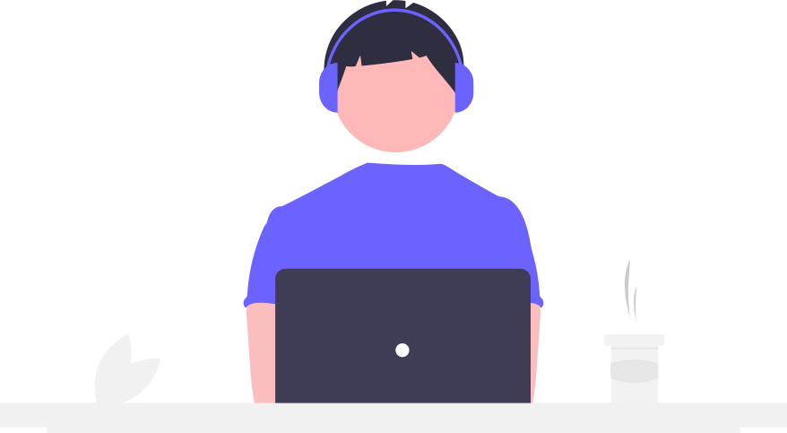

## Hi there 👋, I'm Debargho

<!--
 is a ✨ _special_ ✨ repository because its `README.md` (this file) appears on your GitHub profile.

Here are some ideas to get you started:

- 🔭 I’m currently working on ...
- 🌱 I’m currently learning ...
- 👯 I’m looking to collaborate on ...
- 🤔 I’m looking for help with ...
- 💬 Ask me about ...
- 📫 How to reach me: ...
- 😄 Pronouns: ...
- ⚡ Fun fact: ...
-->

Hi, I'm **Debargho Basak**. I _read_, I _write_ and I _build_ for AI models.

- 🌱 This semester I am writing my Master's Thesis on the topic:'Deep Learning based Multi-Modal Tracking for Long Range 3D Perception'.
- 🎓 Currently pursuing a Master's of Computer Science at the [Technical University of Munich](https://www.cit.tum.de/en/cit/home/).
- 🎓 Bachelor of Engineering from Netaji Subhas Institute of Technology (Delhi University).
- 📫 How to reach me: I am always available at [debarghobasakde@gmail.com](mailto:debarghobasakde@gmail.com). Or you could DM me [@debarghobasak](https://www.instagram.com/debarghobasak1999/). I will get back to you as soon as possible.
- ⚽ 
- 👾 Fun Fact: It's canon that Doomguy is a descendant of B.J. Blazkowicz. ([Source](https://doom.fandom.com/wiki/B.J._Blazkowicz))

## Languages

<table>
    <tr>
        <td>
             
        </td>
        <td>
            
        </td>
        <td>
            
        </td>
        <td>
            
        </td>
        <td>
            
        </td>
    </tr>
</table>

## Tools and Frameworks

<table>
    <tr>
        <td>
             
        </td>
        <td>
            
        </td>
        <td>
            
        </td>
        <td>
            
        </td>
        <td>
            
        </td>
    </tr>
    <tr>
        <td>
             
        </td>
        <td>
            
        </td>
        <td>
            
        </td>
        <td>
            
        </td>
        <td>
            
        </td>
    </tr>
</table>

---
